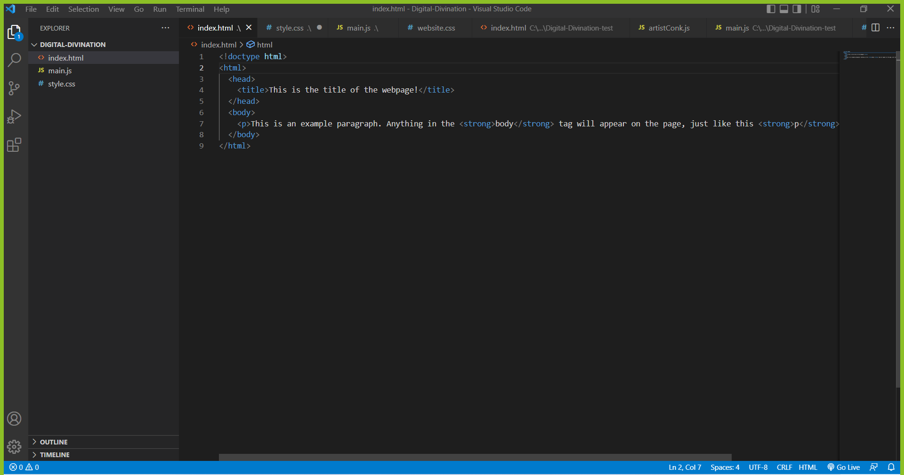
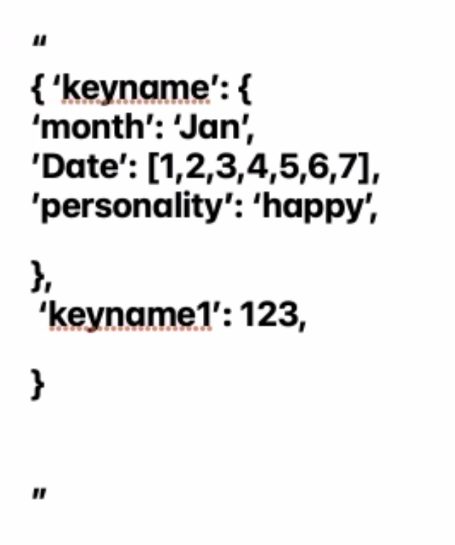
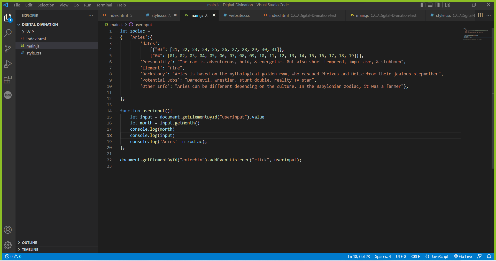
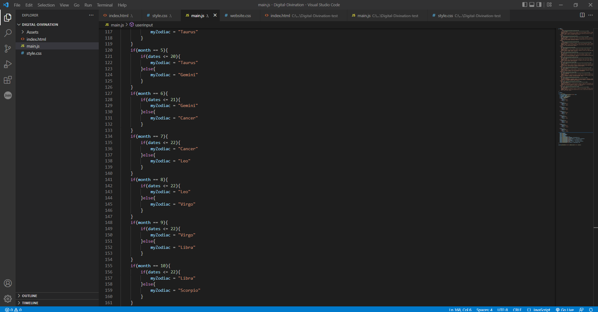
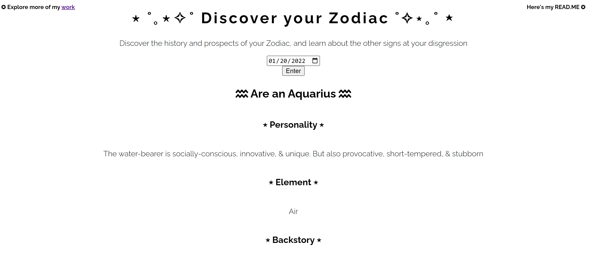
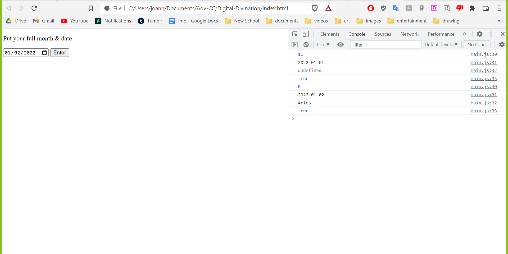
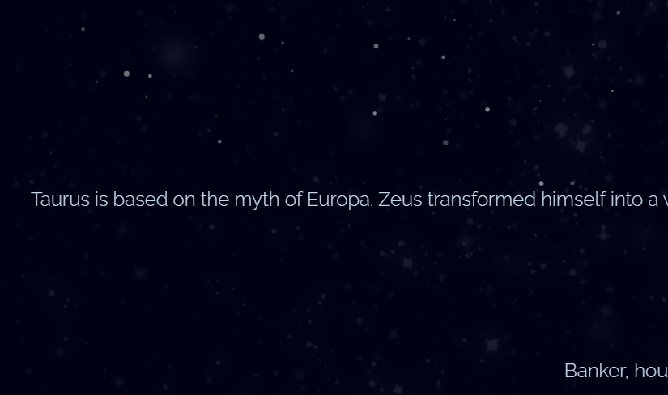
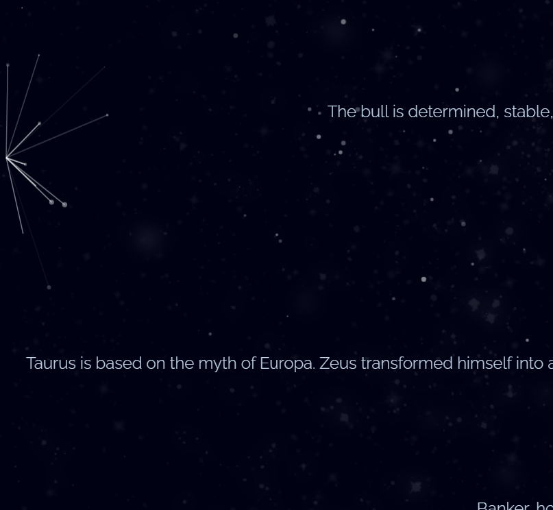

# Digital Diviniation - Zodiac
A tool where users can enter in their birthday to learn more about their zodiac sign

The website can be found [here](https://joannafko.github.io/digitaldiviniation/)

The portfolio can be found [here](https://joanna-ko.glitch.me/p4.html)

 ## About
For this project I decided to do a project related to the western zodiac. Early in the process, I initially thought about creating an interactive route game, in which you can interact with and learn about a certain type of religion. I wasn't exactly sure which religion I would choose, but I knew that I would work with some type of mythology

I decided to do something more general and anachronistic by choosing the western zodiac, which is mostly based in Greco-Roman mythology. During my research I discovered how the same zodiac is represented in different cultures. Like the Leo sign would be a crocodile in a different culture, instead of a lion. I found that to be fascinating, and I wanted to share it with both Zodiac enthusiasists and just normal people alike.

 ## Process & Documentation
I first got to started with the basics like the HTML, the style sheet, and the javascript. I got help from one of the DT tutors, Elena Pang, to guide me through creating the technical aspects of the projects. With her assistance, I created objects for the signs. I then created and objects with the names of the signs, with the properties including things such as "personality" and "element." I then did that 11 more times.

 

I then created an input and button that has a calender built in. Using if else statements, I made it so that the signs matched their corresponding match and end dates, was able to express the properties through the paragraph tags. I added a few more details, like the sub heading titles to the properties, the text symbols for decor, and the links to the about and README pages

Once I completed the technical aspects of the website, I moved onto the cosmetic elements. I drew a starry background with photoshop. I wasn't satisfied with that, so I went to a video tutorial (linked down bellow), to create animating particles that were floating in the background. I used codepen to get the javascript, and then I tweeked that script so that it resembled more stars. I finally created an about page that summarized the digital diviniation tool. And that was about it. I ended up forgowing the background when it became difficult to maintain alongside the particles.

## Challenges & Struggles
The first challenge I faced were the objects and if /else statements. It was extremely difficult keeping up with the variables and documents, because they were usually off by several days or even a month. As shown in the console logs. It was fixed by making the the month variable get added by one.

I ran into another challenge with the particles. Firstly, I had trouble getting the particles to extend to the bottom of the page (because my page had to be scrolled). No matter how much I try to change the canvas position, it rarely budged. Another challenge I encountered was with the margins. I had to create them so that the sentences were touching the edges of the screen, but it also caused the webs of the particles to appear if you hover the cursor over them. This error didn't bother me as much, but it would still be nice to now if I can fix it or not.

## References

[Codepen](https://codepen.io/VincentGarreau/pen/bGxvQd)

[Dynamic background tutorial](https://youtu.be/ELV32bqMBlc)